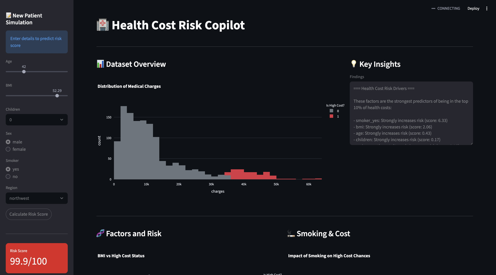
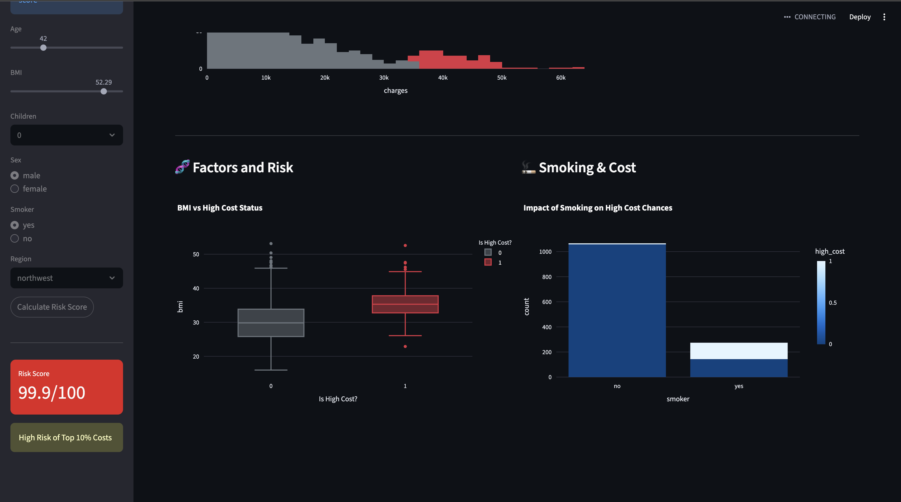

# Health Cost Risk Copilot 🏥

This project uses ML to predict whether a person belongs to the **high-cost** group (top 10% of medical charges) based on simple factors like age, BMI, and lifestyle habits. It then assigns a "Risk Score" from 0 to 100 for every individual.

## What this project does
- Fetches real-world medical cost data from the web.
- Trains a smart model to recognize patterns linked to high medical bills.
- Generates a "Risk Score" for individuals.
- Explains which factors (like smoking or age) are pushing costs up the most.





## How to Run

1. **Install requirements:**
   ```bash
   pip install -r requirements.txt
   ```

2. **Launch the Dashboard (Recommended):**
   This opens a beautiful, interactive page in your browser to see the results and test the model.
   ```bash
   streamlit run src/dashboard.py
   ```

3. **Or run step-by-step in the Terminal:**
   - **Train the Model:** `python -m src.train_model`
   - **Get Scores:** `python -m src.score`
   - **See Insights:** `python -m src.explain`

## What's Created?

- `outputs/model.joblib`: The "brain" of the model.
- `outputs/scored.csv`: A spreadsheet containing everyone's original data + their new **Risk Score**.
- `outputs/insights.txt`: A simple text file explaining the top risk drivers.
